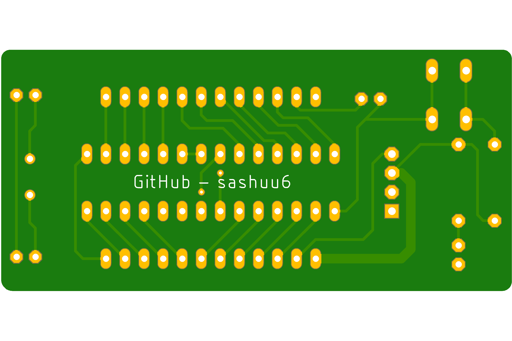
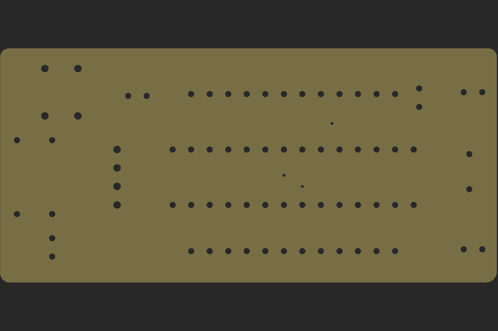

# Introduction

The repository contains the eagle files for an ardunio uno clone with small size. The design imphasizes on production ready design. Users can design hats for the device

## Models

### EOS MC ONE (Without Programmer)

#### Top View

#### Bottom View

#### Drill View
